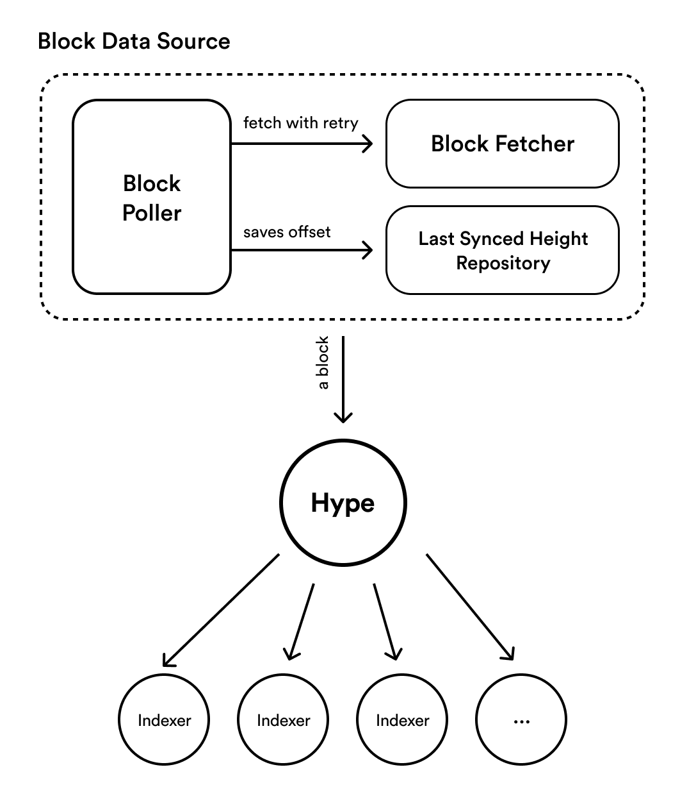

Hype
======

An experimental indexer framework. Allows subscribing on-chain events from Terra Blockchain.

## Architecture Overview



## Example

### Indexing CW20 Transfer Logs in Real-Time

```ts
const datasource = new BlockPoller(
  new HiveBlockFetcher(),
  saveLastSyncedHeightInHivePersistence(new DynamoDBDriver({ ... })),
);

const hype = new Hype(datasource);
hype.subscribe('cw20-transfer', createPersistentIndexer(Cw20TransferLog, async (block) => {
    return findAndParseEvents(block, [
      createReturningLogFinderRule(
        {
          type: 'from_contract',
          attributes: [
            ['contract_address'],
            ['action', 'transfer'],
            ['from'],
            ['to'],
            ['amount'],
          ],
        },
        (_, match) => Cw20TransferLog.create({
          token: match[0].value,
          from: match[2].value,
          to: match[3].value,
          amount: match[4].value,
        }),
      ),
    ]);
  },
));
await hype.start();
```

### Indexing Specific Range of Blocks

Replace `BlockPoller` with `BlockBackFiller`.

```ts
const datasource = new BlockBackFiller(
  new HiveBlockFetcher('https://hive.terra.dev/graphql'),
  4980471, 4981423,
);
const hype = new Hype(datasource);

hype.subscribe('cw20-transfer', ...);
hype.start();
```
