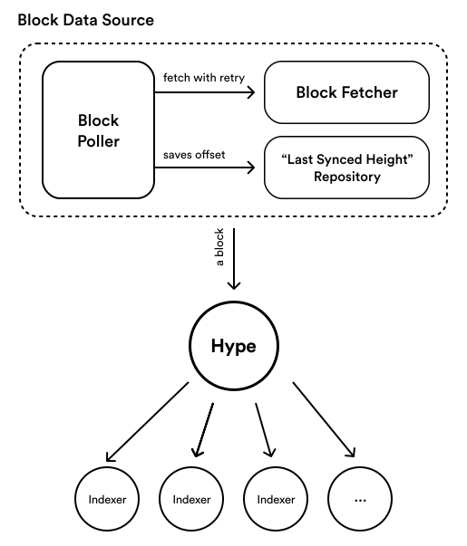

Production-ready Indexer framework for Terra blockchain. Allows subscribing on-chain events from Terra,
and provides utilities for maintenances like back-filling previous data.

## Getting Started

```
$ yarn add @therne/hype
```

## Architecture Overview



## Example

### Subscribing CW20 Transfers in Real-Time

```ts
const hype = await createRealtimeHype();
const ancTransferFinder = createCw20TransferLogFinder('terra14z56l0fp2lsf86zy3hty2z47ezkhnthtr9yq76');

hype.subscribe('anchor-transfer', async (block) => {
  extractEventsInBlock(block, [ancTransferFinder])
    .forEach(({ txHash, event: { from, to, amount } }) => {
      console.log(`Sent ${amount} ANC from ${from} to ${to}`);
      console.log(` -> https://finder.terra.money/mainnet/tx/${txHash}`);
    });
});

await hype.start();
```

### Indexing CW20 Transfer Logs in Real-Time

```ts
const datasource = new BlockPoller(
  new LCDBlockFetcher(),
  saveLastSyncedHeightInHivePersistence(new DynamoDBDriver({...})),
);

const hype = new Hype(datasource);
hype.subscribe(
  'cw20-transfer',
  createPersistentIndexer(Cw20TransferLog, async (block) =>
    extractEventsInBlock(block, [
      createReturningLogFinder(
        {
          type: 'from_contract',
          attributes: [
            ['contract_address'],
            ['action', 'transfer'],
            ['from'],
            ['to'],
            ['amount'],
          ],
        },
        (_, match) => Cw20TransferLog.create({
          token: match[0].value,
          from: match[2].value,
          to: match[3].value,
          amount: match[4].value,
        }),
      ),
    ])
  ),
);
await hype.start();
```

### Indexing Specific Range of Blocks

Replace `BlockPoller` with `BlockBackFiller`.

```ts
const datasource = new BlockBackFiller(
  new FCDBlockFetcher('https://hive.terra.dev/graphql'),
  4980471, 4981423,
);
const hype = new Hype(datasource);

hype.subscribe('cw20-transfer', ...);
hype.start();
```
